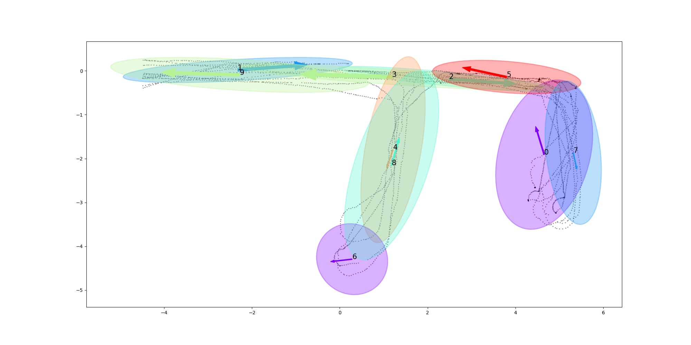

# MapAbstractionVPR
This repository corresponds to the work entitled "[Unsupervised appearance map abstraction for indoor Visual Place Recognition with mobile robots](https://ieeexplore.ieee.org/abstract/document/9808108/)", accepted in IEEE Robotics and Automation Letters. 


**Authors:** [Alberto Jaenal](https://mapir.isa.uma.es/mapirwebsite/?p=2022), [Francisco-Angel Moreno](https://mapir.isa.uma.es/mapirwebsite/?p=1721) and [Javier Gonzalez-Jimenez](https://mapir.isa.uma.es/mapirwebsite/?p=1536)


**Video:** [Click Here](https://www.youtube.com/watch?v=i6oXaAKcEII)



## Cite
If you use this work in your research, please cite:

@ARTICLE{jaenal2022unsupervised,
  author={Jaenal, Alberto and Moreno, Francisco-Angel and Gonzalez-Jimenez, Javier},
  journal={IEEE Robotics and Automation Letters}, 
  title={Unsupervised Appearance Map Abstraction for Indoor Visual Place Recognition With Mobile Robots}, 
  year={2022},
  volume={},
  number={},
  pages={1-7},
  doi={10.1109/LRA.2022.3186768}}

## Instructions

1. Donwload the demo data into the `data` folder:
```
mkdir data && cd data && wget http://ftp.uma.es/Mapir/MapAbstractionVPR/data/feats-ImRet.npy && wget http://ftp.uma.es/Mapir/MapAbstractionVPR/data/feats-NetVLAD.npy && wget http://ftp.uma.es/Mapir/MapAbstractionVPR/data/poses.txt
```

2. Run the map abstraction script

```
python run.py -p data/poses.txt -f data/feats-NetVLAD.npy -c 10
```

## Dependencies

This software employs built-in libs (see `requeriments.txt`), and has been tested with Python>=3.5 on Ubuntu 16.04, 18.04 and 20.04.

The `geometry.py` script is inspired in [ProbFiltersVPR](https://github.com/mingu6/ProbFiltersVPR)0